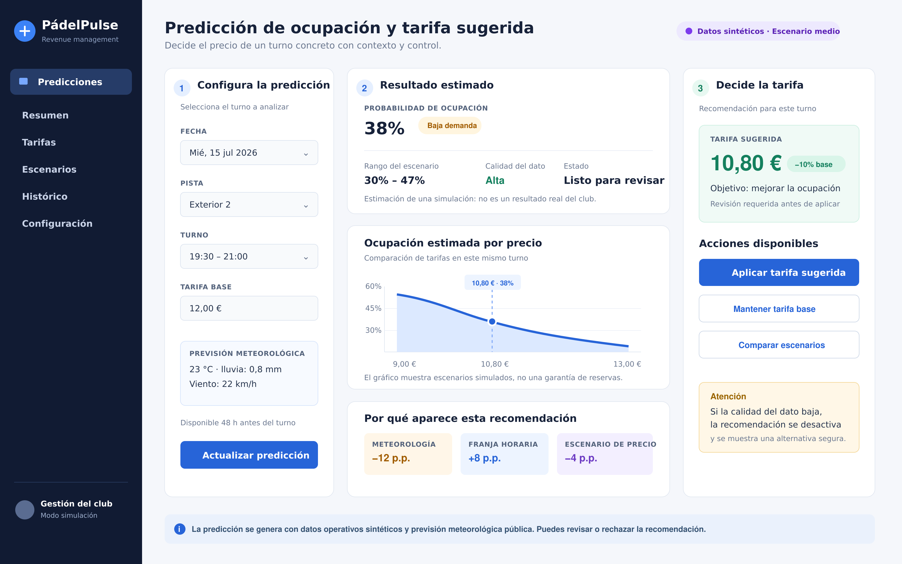

# Entrega 5: Diseño del frontal y experiencia de usuario

## 1. Resumen de la solución y del usuario

El proyecto aborda un problema habitual en clubes de pádel: las tarifas fijas no tienen en cuenta que la demanda cambia según el turno, el día, el tipo de pista y la meteorología. Esto puede dejar pistas vacías en horas valle y limitar la capacidad de reacción del gestor.

El usuario principal es la persona responsable de la gestión del club. Necesita revisar, con al menos 48 horas de antelación, si un turno concreto tiene riesgo de quedar libre y decidir si mantiene o ajusta la tarifa publicada. No se pretende sustituir su criterio: la decisión final siempre será suya.

El producto diseñado es un **dashboard operativo con predictor y recomendador de tarifa**. A partir de la fecha, pista, turno, tarifa base y previsión meteorológica, mostrará una probabilidad estimada de ocupación y una tarifa sugerida dentro de límites configurados. La acción principal es aplicar la sugerencia o mantener la tarifa actual después de revisarla.

En el MVP, las reservas, tarifas y resultados del modelo proceden de una simulación documentada. La previsión meteorológica se basa en datos públicos, pero la ocupación y la respuesta al precio son sintéticas. Por tanto, el frontal comunica resultados de escenario, no una afirmación sobre el comportamiento real de un club.

## 2. Mockup del frontal principal

La pantalla principal sigue el recorrido de izquierda a derecha: configurar el turno, comprender la predicción y decidir qué hacer con la tarifa.

El diseño incluye navegación lateral, estado visible de simulación, entradas, resultado, explicación, acciones y una alerta. La etiqueta «Datos sintéticos · Escenario medio» evita que el usuario confunda el prototipo con un sistema conectado a datos reales.

## 3. Justificación del diseño

### 3.1. Utilidad y valor de la solución

El frontal convierte una predicción técnica en una decisión concreta: revisar el precio de un turno con baja ocupación estimada. En lugar de que el gestor tenga que cruzar manualmente calendario, tipo de pista, clima y comportamiento histórico, concentra la información relevante en una misma pantalla.

La información esencial es la siguiente:

- el turno que se está analizando: fecha, pista, franja y tarifa base;
- la probabilidad de ocupación, su rango de escenario y la calidad del dato;
- la tarifa sugerida y su diferencia respecto a la tarifa base;
- los principales factores que explican el resultado;
- las opciones para aplicar, rechazar o comparar la recomendación.

Se ha decidido no mostrar en la pantalla principal métricas técnicas como ROC-AUC, Brier score, variables codificadas, versión completa de los parámetros o detalles del entrenamiento. Son útiles para validar el proyecto, pero no para una decisión diaria de precio. Esos elementos quedarían en una vista de detalle para análisis del modelo.

La recomendación no se presenta como una orden automática. El modelo estima la ocupación y una regla de negocio, limitada por el escenario elegido, propone una variación máxima del 10 %. El gestor puede aplicarla, mantener el precio o comparar escenarios antes de actuar. Así se ahorra tiempo sin eliminar control humano ni atribuir una certeza inexistente al modelo.

### 3.2. Flujo de usuario

1. **Entrada.** El gestor abre «Predicciones» y ve el estado del producto: trabaja con datos sintéticos y el escenario de sensibilidad al precio activo.
2. **Selección.** Indica la fecha, la pista, el turno y la tarifa base. El frontal muestra también la previsión meteorológica disponible 48 horas antes, especialmente relevante para pistas exteriores.
3. **Procesamiento.** Al pulsar «Actualizar predicción», el sistema consulta los datos del turno, crea las variables de calendario e histórico disponibles y ejecuta el modelo de probabilidad de ocupación. Después aplica la regla de tarifa del escenario seleccionado.
4. **Resultado y revisión.** El gestor recibe la probabilidad estimada, el rango del escenario, la calidad del dato, el gráfico de ocupación por precio y los factores principales. Puede entender de dónde procede la sugerencia sin necesitar conocer el algoritmo.
5. **Acción.** Puede aplicar la tarifa sugerida, conservar la tarifa base o abrir una comparación de escenarios. En el producto final, aplicar la tarifa pediría confirmación y dejaría un registro de la decisión.

Situaciones excepcionales previstas:

| Situación | Respuesta del frontal |
| --- | --- |
| Falta una entrada obligatoria o hay una tarifa inválida | Se marca el campo y se explica qué debe corregirse antes de calcular. |
| No hay previsión meteorológica disponible | Se avisa de la limitación y se calcula solo si el modelo admite ese dato faltante; en caso contrario, se ofrece la referencia histórica. |
| Calidad de dato baja o el turno está fuera del escenario | Se muestra una alerta y se desactiva «Aplicar tarifa sugerida». El gestor puede mantener el precio o revisar el detalle. |
| Turno bloqueado o ya reservado | No se genera recomendación de precio y se indica el estado del turno. |
| Error de carga o del modelo | Se muestra un mensaje sencillo, se conserva la última selección y se permite reintentar. |

### 3.3. Experiencia de usuario

La jerarquía visual responde a la tarea: primero se configuran los datos en la columna izquierda, después se ve el resultado en el centro y, por último, se decide en la columna derecha. La probabilidad de ocupación y la tarifa sugerida usan el tamaño mayor porque son los dos elementos que deben captar la atención antes que el resto.

La pantalla evita la sobrecarga. Solo incorpora cuatro campos de entrada y tres factores explicativos. Los colores tienen un significado constante: azul para interacción y predicción, verde para una recomendación revisable, ámbar para advertencias y morado para identificar el contexto de simulación. Las tarifas incluyen el símbolo de euro, las probabilidades el porcentaje y la meteorología sus unidades.

Para crear confianza, se muestra un rango de ocupación y una nota que aclara que se trata de una estimación de escenario. El gráfico compara alternativas de precio y la sección «Por qué aparece esta recomendación» ofrece causas resumidas. Ninguna cifra se presenta como garantía de que habrá reservas.

El control del usuario se mantiene en todo momento: puede modificar los datos de entrada, actualizar la predicción, conservar la tarifa original o comparar escenarios. La aplicación requiere una revisión antes de aplicar una sugerencia. Las alertas proponen una alternativa segura en lugar de ocultar el problema.

El mockup está pensado para escritorio porque el gestor revisará varios datos y gráficos a la vez. En una versión móvil, las tres columnas pasarían a secciones verticales, con la tarjeta de resultado y las acciones al principio. Se usarán texto legible, contraste suficiente, etiquetas además de colores y botones grandes para que el diseño sea accesible.

## 4. Presentación de resultados y explicabilidad

El resultado principal es la **probabilidad estimada de ocupación** del turno, acompañada de una **tarifa sugerida**. La tarifa no procede de una optimización que se declare válida para clientes reales: es el resultado de una regla de negocio aplicada sobre la probabilidad y los supuestos del escenario sintético.

Para interpretarlo, la pantalla muestra:

- el rango del escenario, en lugar de una cifra aislada;
- la calidad del dato y el estado de la recomendación;
- la comparación de ocupación estimada para varios precios;
- los factores con mayor influencia, como meteorología, franja horaria y escenario de precio;
- una nota visible sobre la naturaleza sintética de la simulación.

Esta combinación evita presentar una estimación como certeza. Si la calidad del dato es baja, faltan variables importantes o no existe una recomendación válida, el sistema no permitirá aplicar una nueva tarifa automáticamente. La vista de detalle podrá incluir la versión del modelo, fecha de ejecución, métricas de calibración, variables utilizadas y parámetros del generador; no aparecen en el frontal principal porque no ayudan a resolver la decisión inmediata.

No se utilizará IA generativa en el MVP. La explicación será una plantilla controlada basada en los factores y resultados calculados por el modelo, por ejemplo: «La previsión de lluvia reduce la ocupación estimada de una pista exterior». De este modo, cada mensaje mantiene trazabilidad con los datos mostrados y no inventa causas.

## 5. Alcance del MVP

Al terminar el curso se implementará un prototipo funcional, no una conexión con un club real. El alcance previsto es:

| Elemento | Alcance al final del curso |
| --- | --- |
| Selección de fecha, pista, turno y tarifa base | Funcional sobre el conjunto de datos sintético. |
| Predicción de ocupación | Funcional con el modelo seleccionado frente al baseline histórico. |
| Sugerencia de tarifa | Funcional mediante una regla configurable con límites de ±10 % y escenarios de sensibilidad baja, media y alta. |
| Gráfico, factores y alertas | Funcionales a partir de los resultados generados; los textos explicativos serán controlados. |
| Aplicar tarifa | Simulará la decisión y la guardará en el entorno local del prototipo; no modificará reservas ni tarifas de un club real. |
| Navegación completa, autenticación, integración con reservas y notificaciones | Representación visual o trabajo futuro, fuera del MVP. |

La tecnología prevista es **Python**, **Pandas** y **scikit-learn** para el tratamiento de datos y el modelo; **Streamlit** para el frontal; y **Plotly** para los gráficos interactivos. La primera implementación priorizará que una predicción sea repetible, explicable y coherente con el escenario sintético antes de ampliar la interfaz o añadir automatizaciones.
