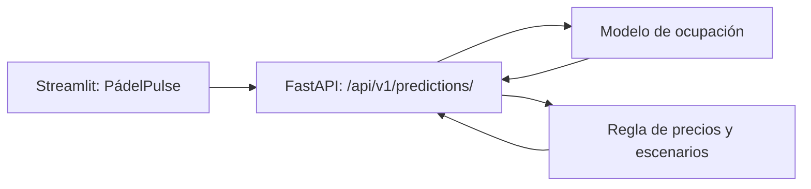

# Resultados, decisiones y límites del MVP

## 1. Propósito del documento

Este documento deja trazabilidad de las decisiones técnicas, los resultados y
las limitaciones del MVP de predicción de ocupación y recomendación de tarifas
para clubes de pádel. Complementa las entregas previas del proyecto sin
modificarlas.

El objetivo del MVP es estimar la probabilidad de que un turno termine ocupado
48 horas antes de su inicio y usar esa probabilidad en una regla de precios
limitada. No pretende demostrar el precio óptimo ni el impacto económico real
de un club.

## 2. Datos y reproducibilidad

### 2.1. Alcance de los datos

La parte operativa del proyecto es sintética, porque no se dispone de un
dataset público, histórico y verificable de reservas de pádel con el detalle
necesario. La meteorología histórica procede de la fuente pública configurada
(Open-Meteo) y el calendario se construye con festivos públicos.

La simulación cubre 24 meses (2024 y 2025), seis pistas —cuatro exteriores y
dos interiores— y diez turnos diarios de 90 minutos. Esto produce 43.860
turnos ofertados. No se usan datos personales de clientes.

Todas las salidas dependen de una semilla y de parámetros versionados en
`config/simulation_config.json`. Por tanto, son reproducibles, pero solo son
válidas dentro del escenario simulado.

### 2.3. Escala de tarifas sintética

La simulación utiliza 16 € como tarifa base de una pista exterior de 90
minutos, con suplementos de 4 € en las horas punta, 1 € en fin de semana y 2
€ en pista interior. Esta escala no procede de la operación de ningún club:
solo fija un contexto plausible y versionado para el MVP. Como contraste
externo, se consultaron tarifas públicas de instalaciones de Gran Canaria, que
publican importes de 10–15 € para 90 minutos según franja en instalaciones
municipales y de 16–30 € como intervalo habitual declarado por un club de la
isla ([Federación de Tenis de Gran Canaria](https://federaciontenisgrancanaria.com/instalaciones/Tarifas.pdf)
y [Club de Pádel Bida](https://clubdepadelbida.com/)). Las fuentes se usan para
ordenar la magnitud de la simulación, no para entrenar el modelo ni para
atribuir esos precios a un club concreto.

La regla de recomendación admite tarifas entre 14 € y 30 €, pero nunca cambia
más de un ±10 % la tarifa vigente en una única decisión.

### 2.2. Pipeline de calidad

El pipeline sigue tres capas:

| Capa | Contenido | Tratamiento |
| --- | --- | --- |
| Raw | Extracto operativo sintético y meteorología | Incluye incidencias controladas para probar la limpieza. |
| Silver | Datos tipados y normalizados | Elimina duplicados, normaliza fechas/precios/categorías e imputa previsiones ausentes. |
| Gold | Dataset analítico final | Se publica solo tras superar las validaciones de calidad. |

Las incidencias de Raw son pequeñas, reproducibles y documentadas. No se
interpretan como errores observados en un club real.

## 3. Análisis exploratorio

Gold superó los controles de calidad: no contiene `id_slot` duplicados ni
turnos bloqueados u ocupados a la vez. Los principales resultados son:

| Indicador | Resultado |
| --- | ---: |
| Turnos ofertados | 43.860 |
| Turnos bloqueados | 471 |
| Ocupación de turnos elegibles | 32,24 % |
| Cancelaciones sobre turnos no bloqueados | 2,83 % |
| Ingresos finales simulados | 258.216,00 € |

Los patrones relevantes para modelado y negocio fueron:

- Tarde y noche alcanzan aproximadamente un 41 % de ocupación, frente a
  un 26 % por la mañana y al mediodía.
- Sábado y domingo alcanzan aproximadamente un 36 % de ocupación, por encima
  de los días laborables (alrededor del 30–31 %).
- En pistas exteriores, la ocupación pasa de 37,22 % sin lluvia a 16,53 %
  con lluvia moderada o alta.
- Las pistas interiores tienen una ocupación media menor en este escenario.
  No es una conclusión general: también tienen una tarifa media superior y la
  comparación no controla el resto de variables.

El EDA identifica asociaciones internas del escenario; no demuestra relaciones
causales entre precio y ocupación.

## 4. Diseño del experimento de ocupación

### 4.1. Objetivo y prevención de fuga de información

La variable objetivo es `ocupado_final` (`1` ocupado, `0` libre). Los turnos
bloqueados se excluyen del entrenamiento y de la evaluación.

La predicción se realiza 48 horas antes. Por ello se usan únicamente variables
conocidas en ese momento:

- pista, tipo de pista, día, mes, fin de semana, festivo, franja y hora exacta;
- tarifa publicada;
- previsión de temperatura, precipitación y viento;
- indicadores de previsión imputada;
- interacciones entre climatología prevista y pista exterior.

No se usan cancelaciones, ingresos, estado final de reserva ni meteorología
observada, porque no estarían disponibles al realizar la predicción.

### 4.2. División temporal y modelos comparados

Se entrena con los 21.704 turnos anteriores al 1 de enero de 2025 y se evalúa
con los 21.685 turnos posteriores. Esta división temporal evita que el modelo
aprenda con información futura.

Se comparan tres alternativas:

| Modelo | Función en el experimento |
| --- | --- |
| Baseline histórico | Referencia de ocupación media por franja, fin de semana y tipo de pista. |
| Regresión logística | Modelo probabilístico explicable. Codifica categorías, escala variables numéricas y aplica regularización. |
| Gradient boosting | Alternativa no lineal para captar interacciones más complejas. |

La regularización de la logística se selecciona dentro del periodo de
entrenamiento mediante `TimeSeriesSplit` con tres particiones. El parámetro
seleccionado fue `C = 0,03`, lo que favorece un modelo estable frente al ruido.

## 5. Resultados del modelo

| Modelo | ROC-AUC | AP | Brier | Log loss | Accuracy (0,5) | Precision | Recall | F1 |
| --- | ---: | ---: | ---: | ---: | ---: | ---: | ---: | ---: |
| Baseline histórico | 0,6198 | 0,4181 | 0,2116 | 0,6125 | 0,6722 | 0,4970 | 0,0574 | 0,1030 |
| Regresión logística | **0,6410** | **0,4580** | **0,2082** | **0,6050** | 0,6831 | 0,5605 | 0,1520 | 0,2392 |
| Gradient boosting | 0,6361 | 0,4486 | 0,2093 | 0,6073 | 0,6777 | 0,5367 | 0,1195 | 0,1955 |

Se selecciona la **regresión logística** porque obtiene el menor Brier score y
mejora al baseline en capacidad de discriminación y calidad de las
probabilidades. La mejora es moderada, no espectacular; es coherente con un
escenario que incluye incertidumbre aleatoria y utiliza pronóstico, no clima
observado.

La accuracy no es la métrica principal: con una ocupación cercana al 32 %,
predecir siempre "libre" obtendría una accuracy cercana al 68 %, pero no
aportaría información útil. El producto necesita probabilidades calibradas,
no decisiones binarias automáticas.

### 5.1. Calibración

| Intervalo de probabilidad | Turnos | Ocupación observada | Probabilidad media | Diferencia absoluta |
| --- | ---: | ---: | ---: | ---: |
| 0,0–0,2 | 3.053 | 0,1759 | 0,1744 | 0,0015 |
| 0,2–0,4 | 14.216 | 0,3053 | 0,2941 | 0,0112 |
| 0,4–0,6 | 4.153 | 0,4951 | 0,4844 | 0,0107 |
| 0,6–0,8 | 263 | 0,6502 | 0,6210 | 0,0292 |

La calibración es especialmente buena en los intervalos con mayor número de
turnos. El tramo 0,6–0,8 debe interpretarse con cautela por su tamaño reducido.
No se obtuvieron predicciones por encima de 0,8, por lo que el MVP no presenta
las estimaciones como certezas.

## 6. Regla de recomendación de precios

La predicción y el precio se mantienen deliberadamente separados. El modelo
estima la ocupación para la tarifa actual; una regla de negocio compara tarifas
candidatas y usa elasticidades explícitas para proyectar un escenario.

La regla compara −10 %, −5 %, mantener tarifa, +5 % y +10 %, dentro de un
rango configurado de 14 € a 30 €. Solo puede seleccionar las alternativas que
permite el nivel de demanda:

- con probabilidad baja (menor de 30 %) solo permite mantener o descontar;
- con probabilidad alta (mayor de 50 %) solo permite mantener o incrementar;
- con demanda intermedia mantiene la tarifa.

La interfaz muestra las cinco alternativas para hacer visible cómo variaría la
ocupación en el escenario. Las alternativas no permitidas aparecen solo como
comparación visual; nunca se seleccionan ni se presentan como una recomendación.

Las elasticidades de sensibilidad baja, media y alta son supuestos de
configuración. No se estiman de forma causal a partir de los datos simulados.
La decisión final corresponde al gestor y nunca modifica una reserva existente.

## 7. Resultados de escenarios de precio

La siguiente tabla se calcula sobre los 21.685 turnos del periodo de test. Las
reservas e ingresos son **esperados**, es decir, se obtienen al sumar las
probabilidades y `tarifa × probabilidad`; no son resultados reales.

| Escenario | Tarifas modificadas | Reservas esperadas fijas | Reservas esperadas dinámicas | Ocupación esperada dinámica | Ingreso fijo esperado | Ingreso dinámico esperado | Diferencia |
| --- | ---: | ---: | ---: | ---: | ---: | ---: | ---: |
| Sensibilidad baja | 1.928 | 6.888,51 | 6.853,60 | 31,61 % | 127.290,02 € | 128.678,65 € | +1.388,63 € |
| Sensibilidad media | 1.928 | 6.888,51 | 6.815,10 | 31,43 % | 127.290,02 € | 127.813,92 € | +523,90 € |
| Sensibilidad alta | 11.095 | 6.888,51 | 7.220,66 | 33,30 % | 127.290,02 € | 128.003,77 € | +713,75 € |

Interpretación:

- En sensibilidad baja y media, 1.928 turnos de demanda alta reciben un aumento
  limitado. El ingreso esperado aumenta, aunque se reducen ligeramente las
  reservas esperadas porque el precio es mayor.
- En sensibilidad alta, 11.095 turnos de demanda baja reciben descuentos. Las
  reservas esperadas aumentan en aproximadamente 332 y el ingreso esperado en
  713,75 €.
- La regla ya muestra los tres comportamientos del producto: descuento en valle,
  mantenimiento en demanda intermedia e incremento en demanda alta.

Este último resultado es una consecuencia de la elasticidad asumida. No permite
afirmar que un club real obtendría ese incremento.

## 8. Decisiones tomadas

| Decisión | Motivo | Evidencia |
| --- | --- | --- |
| Usar datos operativos sintéticos | No existe un dataset público verificable con el detalle necesario. | Supuestos y semilla documentados en configuración. |
| Mantener capas Raw, Silver y Gold | Separar extracto, limpieza y consumo analítico. | Gold supera controles de duplicados y consistencia. |
| Dividir por tiempo | Evitar aprendizaje con información futura. | Entrenamiento 2024 y test 2025. |
| Elegir regresión logística | Mejor Brier, ROC-AUC, AP y log loss frente a las alternativas. | Tabla de resultados de test. |
| Priorizar Brier score | El producto consume probabilidades, no solo clases. | Tabla de calibración. |
| Separar predicción y precio | No se puede inferir causalmente el efecto del precio con estos datos. | Regla de escenarios explícitos. |
| Limitar cambios a ±10 % y rango 14–30 € | Controlar riesgo y mantener una recomendación prudente. | Configuración de precios. |

## 9. Limitaciones y uso responsable

- Las reservas, precios, cancelaciones, bloqueos y elasticidades son sintéticos.
- Los resultados no representan la operación ni los ingresos de un club real.
- El efecto del precio es un supuesto de escenario, no una estimación causal.
- La recomendación requiere revisión del gestor; no se aplica automáticamente.
- Si se obtuvieran datos reales, habría que reentrenar, recalibrar, validar por
  periodos recientes y revisar posibles cambios de comportamiento.

## 10. Reproducción de resultados

Desde la raíz del repositorio:

```text
python scripts/generate_synthetic_data.py
python scripts/run_eda.py
python scripts/train_occupancy_models.py
python scripts/simulate_pricing_scenarios.py
```

Los informes generados se guardan en `reports/generated/` y el modelo
seleccionado en `models/occupancy_model.joblib`.

## 11. Integración del MVP

La aplicación materializa el flujo analítico en una interfaz para la persona
gestora. Su arquitectura es deliberadamente simple y separa responsabilidades:


```mermaid
flowchart LR
    UI["Streamlit: PádelPulse"] --> API["FastAPI: /api/v1/predictions/"]
    API --> MODEL["Modelo de ocupación"]
    API --> RULE["Regla de precios y escenarios"]
    MODEL --> API
    RULE --> API
```

La pantalla **Predicciones** solicita fecha, pista, hora, tarifa actual y el
pronóstico que estaría disponible 48 horas antes. FastAPI convierte esos datos
en las mismas variables empleadas durante el entrenamiento, carga el artefacto
de regresión logística y devuelve:

- probabilidad estimada de ocupación con la tarifa actual;
- tarifa sugerida, variación porcentual y comparación de candidatas;
- ingreso esperado por turno en cada alternativa;
- explicación de los factores considerados y una advertencia de uso.

El ingreso esperado por turno se interpreta como `probabilidad simulada ×
tarifa`, es decir, una media de muchos turnos comparables, no como un ingreso
garantizado de una reserva. La pantalla separa esta métrica de la curva de
ocupación por precio para que la persona gestora pueda entender el intercambio
entre llenar una hora valle y conservar el ingreso esperado.

Las pantallas **Histórico** y **Escenarios** leen, respectivamente, los
indicadores del EDA y la comparación agregada de precios generados por los
scripts reproducibles. En Escenarios, baja, media y alta son **hipótesis de
respuesta al precio**, no tres estrategias comerciales que el gestor conozca
con certeza. La vista destaca el impacto neto frente a tarifa fija y permite
abrir un turno de referencia ya calculado en Predicciones con la hipótesis
elegida; el gestor puede modificar sus datos y recalcular desde allí.

La interfaz etiqueta todos los resultados como sintéticos y la opción de
aplicar tarifa solo registra una acción simulada. No existe automatización de
cambios comerciales ni de reservas.

Para ejecutar el recorrido completo se generan los datos, EDA, modelo y
escenarios en ese orden, y se inician `uvicorn backend.app.main:app --reload`
y `streamlit run frontend/streamlit_app.py` en terminales separadas.
